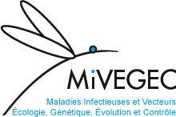

<!-- README.md is generated from README.Rmd. Please edit that file -->

# R scripts to model the risk of residual malaria transmission at a micro-scale

How can we **predict where and when people are likely to contract
malaria in a near future** 🦟 ☀️ 🌧 ?

How can we make the **results of these predictions easily accessible to
anyone**, including the authorities in charge of malaria prevention ?

Through a series of vignettes, we propose a transparent, reproducible
and as much as possible reusable method to model the risk of residual
malaria transmission at a micro-scale and communicate the predictions.
Our study areas are two distinct 2500 km2 wide rural regions
of Western Africa. We use epidemiological, entomological and
sociological data collected during the 3 years-long
[REACT](https://burkina-faso.ird.fr/la-recherche/projets-de-recherche2/gestion-de-la-resistance-aux-insecticides-au-burkina-faso-et-en-cote-d-ivoire-recherche-sur-les-strategies-de-lutte-anti-vectorielle-react)
project over these two areas, in conjunction with environmental data
mostly free of charge and available at global scale.

Our work uses exclusively free and open source softwares/libraries. All
the scripts are developed using the R programming language and rely on
many, many packages developed by the huge R community. We attempt to
develop generic scripts (e.g. land cover mapping, extraction of
spatial-temporal environmental data at sampling points) that can be
reused in various contexts, so do not hesitate to have a look at the
vignettes even if you are not working in the public health research
field \!

Our vignettes :

  - [*Automatic import of spatial-temporal environmental data and
    extraction within buffers around sampling
    points*](https://ptaconet.github.io/malamodpkg/articles/import_tidy_transform_envdata.html)
  - Other vignettes to come \[TODO…\]

Side vignette :

  - [*Land cover mapping at different nomenclature levels built on a
    combined random forest and object based image analysis approach
    using multisource data (HRS, VHRS and
    DEM)*](https://github.com/ptaconet/r_react/blob/master/workflow_object_based_data_analysis.R)
    TODO rmd …

This work is part of my PhD project realized at the
[MIVEGEC](https://www.mivegec.ird.fr/en/) unit of the [French Research
Institute for Sustainable Development](https://en.ird.fr/).

