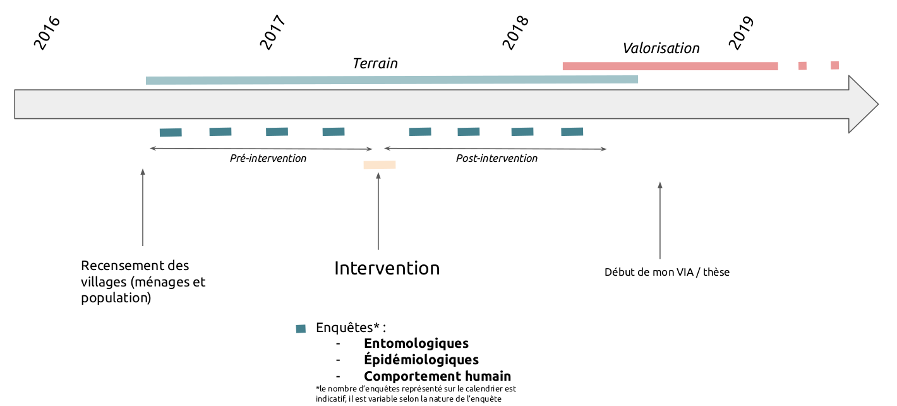
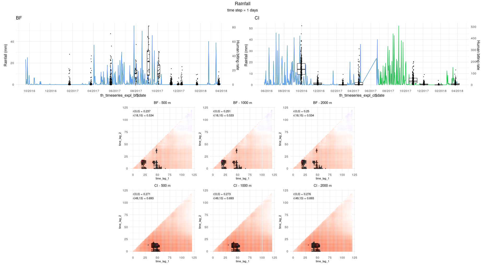
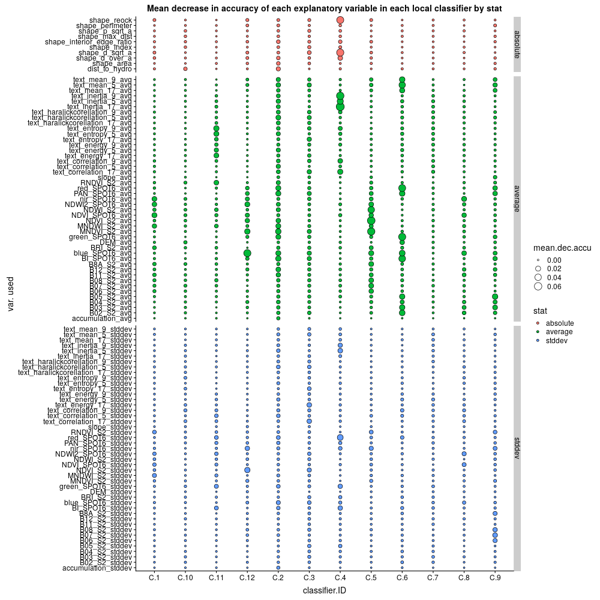

```{r setup, include=FALSE}
knitr::opts_chunk$set(echo = FALSE,
                      message = FALSE,
                      warning = FALSE)

knitr::opts_knit$set(root.dir = rprojroot::find_rstudio_root_file()) #set t
```

```{r packages}
library(ggplot2)
library(scales)
library(sf)
library(DBI)
library(RSQLite)
library(dplyr)
library(tidyr)
library(purrr)
library(rlang)
library(patchwork)
library(plotly)
library(htmlwidgets)
library(kableExtra)
library(mapview)
library(stringr)
library(emo)
library(facetscales)
```

```{r db_connect}
# connect to database
path_to_db <- "data/react_db/react_db.gpkg"
react_gpkg <- DBI::dbConnect(RSQLite::SQLite(),dbname = path_to_db)

# open tables
trmetrics_entomo <- dbReadTable(react_gpkg, 'trmetrics_entomo', stringsAsFactors = F)
entomo_csh_metadata_l1 <- st_read(path_to_db, 'entomo_csh_metadata_l1', quiet=T, stringsAsFactors = F)
recensement_villages_l1 <- st_read(path_to_db,"recensement_villages_l1", quiet=T, stringsAsFactors = F) %>%
  filter(!is.na(intervention)) %>%
  dplyr::select("codevillage","codepays","nomvillage","population","intervention","date_debut_interv","date_fin_interv","X","Y")

trmetrics_entomo2 <- dbReadTable(react_gpkg, 'trmetrics_entomo_postedecapture') %>%
  left_join(entomo_csh_metadata_l1[c("idpointdecapture","nummission","codevillage","pointdecapture","codepays","date_capture","X","Y")], by = "idpointdecapture")

trmetrics_epidemio <- dbReadTable(react_gpkg, 'trmetrics_epidemio')

# # join to trmetrics_entomo the tables related to the HLC dates and locations + villages
# trmetrics_entomo <- trmetrics_entomo %>%
#   left_join(entomo_csh_metadata_l1[c("idpointdecapture","nummission","codevillage","pointdecapture","codepays","date_capture","X","Y")], by = "idpointdecapture") %>%
#   left_join(recensement_villages_l1[c("codevillage","intervention","date_debut_interv","date_fin_interv")], by = "codevillage") %>%
#   dplyr::select(-fid)

# get the number of human - nights
idpointdecaptures <- dbReadTable(react_gpkg, 'entomo_csh_metadata_l1') %>%
  dplyr::select(idpointdecapture,nummission,codevillage,pointdecapture,codepays,date_capture)

csh_exterior <- data.frame(idpointdecaptures, postedecapture = "e")
csh_interior <- data.frame(idpointdecaptures, postedecapture = "i")
csh_all <- rbind(csh_exterior,csh_interior) %>%
  left_join(recensement_villages_l1) %>%
  mutate(phase_interv = ifelse(as.Date(date_capture) < as.Date(date_debut_interv),"pre-intervention","post-intervention")) %>%
  mutate(phase_interv = ifelse((is.na(phase_interv) & codepays=="BF" & as.Date(date_capture) < as.Date("2017-08-17")),"pre-intervention",phase_interv)) %>%
  mutate(phase_interv = ifelse((is.na(phase_interv) & codepays=="CI" & as.Date(date_capture) < as.Date("2017-09-01")),"pre-intervention",phase_interv)) %>%
  mutate(phase_interv = ifelse((is.na(phase_interv) & codepays=="BF" & as.Date(date_capture) > as.Date("2017-08-17")),"post-intervention",phase_interv)) %>%
  mutate(phase_interv = ifelse((is.na(phase_interv) & codepays=="CI" & as.Date(date_capture) > as.Date("2017-09-01")),"post-intervention",phase_interv))


# get mean date for each entomo mission in each country
mean_date_by_mission <- entomo_csh_metadata_l1 %>%
  group_by(codepays,nummission) %>%
  summarise(date = mean(as.Date(date_capture))) %>%
  as_tibble()

# get start and end date of intervention for each country
dates_intervention <- recensement_villages_l1 %>%
  group_by(codepays) %>%
  summarise(start_intervention_date=min(as.Date(date_debut_interv),na.rm = T),end_intervention_date=max(as.Date(date_fin_interv),na.rm = T))
  
```

## Introduction

Notre travail propose de modéliser la dynamique spatio-temporelle de la densité agressive des principales espèces vectrice du paludisme avec des modèles de forêt aléatoire. 

La question de recherche principale : 

- Quels sont les facteurs qui influencentl'agressivité des principales espèces vectrices du paludisme en milieu rural ouest-africain ? 

Questions annexes : 

- Comment expliquer que la densité agressive est significativement différente dans deux zones présentant des faciès environnementaux à priori relativement similaires ? 

## Matériel et méthodes

### Présentation des variables à expliquer

La variable que l'on va modéliser est la densité agressivité des espèce majeure d'Anophèles. Nous utilisons des données receuillies par capture sur sujet humain, sur deux zones d'études différentes (CI et BF), pendant environ 1.5 années.

Nous proposons d'étudier séparement les deux zones d'études pour chaque variable à modéliser car i) la densité agressive est significativement plus importante en CI qu'au BF et ii) certaines variables explicatives sont disponibles dans une zone mais pas dans l'autre. Ainsi il sera intéressant de tenter de comprendre ce qui explique les différences entre les deux zones.

La distribution statistique de chacune de ces variables à modéliser est donnée dans la section "Choix du modèle statistique pour l'analyse de nos données". L'analyse de cette distribution permettra d'orienter le choix du modèle à utiliser pour modéliser chacune des variables.

```{r var_a_expliquer, eval = F }
googlesheets4::sheets_deauth()
df_indicators <- googlesheets4::read_sheet("https://docs.google.com/spreadsheets/d/1dIeSOa2WinXvOQGLmIjA0gFdsHnb6zMMsDME-G5pyMc/edit?usp=sharing", sheet = "var_reponse3", col_types="c")
df_indicators %>%
  kable() %>%
  kable_styling(bootstrap_options = c("striped", "hover", "condensed"))
```

### Source des données terrain : le projet REACT

La carte suivante présente la localisation des villages de l'étude dans les deux zones (BF = Burkina Faso ; CI = Côte d'Ivoire). Les villages sont représentés en fonction de la stratégie complémentaire de LAV implémentée dans chaque village (à noter que la méthodologie utilisée est un Essai randomisé contrôlé, ainsi, certains villages n'ont pas reçu de statégie de lutte complémentaire : il s'agit des villages "Contrôle").

```{r map}
areas <- st_read(path_to_db,"contexte_frontieresreact", quiet=T)
mapview(areas, alpha.regions = 0.1, aplha = 1, layer.name = "Study areas") + mapview(recensement_villages_l1, zcol = "intervention", cex = 4, alpha.regions = 0.9, aplha = 1, layer.name = "Villages")
```

<!--
La figure ci-dessous présente le calendrier simplifié du projet : 

```{r }

```

Pour plus d'informations sur le type de données recueillies pendant le projet et la fréquence de collecte, se référer à la diapo disponible ici : https://docs.google.com/presentation/d/1UBhYPivf3zSXCl3XHUJaCtYjg8jGFTv66rh3OIphuGw/edit#slide=id.g6af768661d_0_222
-->

A titre d'exemple, le tableau ci-après donne les dates des missions entomologiques dans les deux zones d'étude et les captures totales d'Anophèles, et les figures qui suivent donnent la distribution du nombre de piqures par homme et par nuit (human biting rate, abbrégé ma), toutes espèces d'Anophèles confondues, sur les deux zones d'études, en fonction des différents traitements puis tous traitements confondus.

```{r ma_b_country}
# by country

a<-trmetrics_entomo %>%
  filter(var=="ma",genre=="Anopheles") %>%
  group_by(nummission,codepays) %>%
  summarise(ma=sum(val)) %>%
   as_tibble() %>%
  mutate(nummission = as.numeric(nummission))

kable(entomo_csh_metadata_l1 %>%
  st_drop_geometry() %>%
  group_by(codepays,nummission) %>%
  summarise(date = mean(as.Date(date_capture))) %>%
  as_tibble() %>%
  mutate(nummission = as.numeric(nummission)) %>%
  filter(nummission<=8) %>%
  arrange(codepays,nummission,date) %>%
  left_join(a) ) %>%
  kable_styling(bootstrap_options = c("striped", "hover", "condensed"))

ma_an <- trmetrics_entomo %>%
  filter(genre=="Anopheles", var=="ma", as.numeric(nummission) <= 8) %>%
  group_by(idpostedecapture,codepays, nummission, intervention) %>%
  summarise(val = sum(val))

bf <- ggplot(ma_an %>% filter(codepays == "BF", nummission <= 8), aes(x = nummission, y = val, fill = intervention)) +
   geom_boxplot(outlier.shape = NA) +
   ylim(0,40) + # 40 for BF, 400 for CI
   geom_vline(xintercept = 3.5, colour = "red", size = 0.3) +  # 3.4 for BF, 4.5 for CI
   annotate(geom="text",label="start of interventions",x = 3.7, y = 37, colour = "red", angle = 90, size = 3.5) +
   theme_minimal() +
   labs(y = "Human biting rate (all Anoph. species)") +
  ggtitle("BF")


ci <- ggplot(ma_an %>% filter(codepays == "CI", nummission <= 8), aes(x = nummission, y = val, fill = intervention)) +
   geom_boxplot(outlier.shape = NA) +
   ylim(0,400) + # 40 for BF, 400 for CI
   geom_vline(xintercept = 4.5, colour = "red", size = 0.3) +  # 3.4 for BF, 4.5 for CI
   annotate(geom="text",label="start of interventions",x = 4.7, y = 370, colour = "red", angle = 90, size = 3.5) +
   theme_minimal() +
   labs(y = "Human biting rate (all Anoph. species)") +
  ggtitle("CI")

bf
ci


th_timeseries_resp_bf <- trmetrics_entomo2 %>%
    left_join(entomo_csh_metadata_l1[c("idpointdecapture","codepays","date_capture","nummission")], by = "idpointdecapture") %>%
    filter(codepays.x == "BF") %>%
    left_join(mean_date_by_mission %>% filter(codepays=="BF"), by = c("nummission.x"="nummission"))
  
th_timeplot_bf <-  ggplot() + 
    geom_boxplot(aes(x = th_timeseries_resp_bf$date, y = th_timeseries_resp_bf$ma_an, group = th_timeseries_resp_bf$date), show.legend = TRUE, outlier.shape=NA) + 
    geom_jitter(aes(x = th_timeseries_resp_bf$date, y = th_timeseries_resp_bf$ma_an, group = th_timeseries_resp_bf$date), position=position_jitter(2), cex=0.3) + 
    scale_x_date(date_labels = "%m/%Y", date_breaks = "2 months") +
    theme(axis.text.x = element_text(angle = 90, hjust = 1)) +
    theme_minimal() +
    ggtitle("BF") +
    ylim(0,60)  +
  ylab("Human biting rate (all An. species)")


th_timeseries_resp_ci <- trmetrics_entomo2 %>%
    left_join(entomo_csh_metadata_l1[c("idpointdecapture","codepays","date_capture","nummission")], by = "idpointdecapture") %>%
    filter(codepays.x == "CI") %>%
    left_join(mean_date_by_mission %>% filter(codepays=="CI"), by = c("nummission.x"="nummission"))
  
th_timeplot_ci <-  ggplot() + 
    geom_boxplot(aes(x = th_timeseries_resp_ci$date, y = th_timeseries_resp_ci$ma_an, group = th_timeseries_resp_ci$date), show.legend = TRUE, outlier.shape=NA) + 
    geom_jitter(aes(x = th_timeseries_resp_ci$date, y = th_timeseries_resp_ci$ma_an, group = th_timeseries_resp_ci$date), position=position_jitter(2), cex=0.3) + 
    scale_x_date(date_labels = "%m/%Y", date_breaks = "2 months") +
    theme(axis.text.x = element_text(angle = 90, hjust = 1)) +
    theme_minimal() +
    ggtitle("CI") + 
    ylim(0,400) +
  ylab("Human biting rate (all An. species)")


th_timeplot_bf / th_timeplot_ci
  
```

### Les variables explicatives / prédictives

Les variables explicatives qui serviront dans les modèles mathématiques sont données dans le tableau suivant, avec les informations notamment sur les données sources utilisées et les pré-traitements effectués. Il s'agit principalement de variables climatiques (températures, précipitations, etc.), paysagères (occupation du sol), anthropiques et démographiques (population). Le tableau est aussi disponible à l'adresse suivante https://docs.google.com/spreadsheets/d/1dIeSOa2WinXvOQGLmIjA0gFdsHnb6zMMsDME-G5pyMc/edit?usp=sharing onglet "var_explication".

Ces variables peuvent être séparées en 3 groupes :

- les **variables spatio-temporelles** : ce sont des variables dont les données sources sont de type raster et ayant une composante temporelle (e.g. températures, précipitations, indices de végétation ou d'eau issus des produits MODIS et Sentinel)
- les **variables spatialisées non temporelles** : ce sont des variables dont les données sources sont de type raster mais n'ayant pas de composante temporelle (e.g. occupation du sol dérivée de l'image SPOT6, altitude, population, etc)
- les **variables non spatialisées et non temporelles** : ce sont des variables dont les données sources ne sont pas rasterisées et n'ont pas de composante temporelle (e.g. méthode de LAV, distance à la frontière du village)

Les variables spatialisées ont été extraites autour de chaque point de capture selon plusieurs zones tampon, afin de mesurer l'éventuelle influence de la variabilité spatiale de ces variables explicatives sur les variables à expliquer. Les rayons des zones tampon dépendent de la résolution spatiale des données sources. Ils vont de 20 mètres (pour les métriques paysagères calculées avec l'images SPOT6 à 1.5 m de résolution spatiale) à 2 km (distance maximum de vol dans la vie d'un moustique selon la bibliographie). Voir le tableau ci-dessous, colonne "buffer_size_extraction_m", pour le détail des tailles de buffer utilisées pour chaque variable.

Les variables temporelles ont été extraites durant les 120 jours (4 mois) précédent la date de capture ou d'enquête épidémiologique, afin de mesurer l'éventuelle influence temporelle de ces variables explicatives sur les variables à expliquer (cela sera fait via la génération de cross correlation maps, cf. section plan d'analyse de données). Cette durée maximale de 120 jours a été utilisée dans d'autres études similaires. Elle permet de couvrir largement la durée de vie d'un vecteur (en général, maximum 1 mois) et de prendre en compte l'éventuelle influence des générations de vecteurs précédent. Notons que les données temporelles ont des résolutions temporelles (i.e. temps de revisite) variables selon les sources : cela va du quotidien (températures de MODIS, précipitations de GPM) au mensuel (lumières noctures) en passant par l'hebdomadaire (évapotranspiration ou indices de végétation de MODIS), la dizaines de jours (Sentinel-1), etc.

Ainsi, si **n** est le nombre de jours précédent la capture pour lesquels nous avons extrait les données temporelles (ici n = 120), **r** la résolution temporelle de la donnée source de la variable à extraire, et **m** le nombre de zones tampon pour une variable spatiale considérée :

- Les données spatialisées et temporelles contiennent, pour chaque couple {point de capture, variable} , **n** / **r** * **m** valeurs ; 
- Les données spatialisées non temporelles contiennent, pour chaque couple {point de capture, variable}, **m** valeurs ;
- Les données non spatialisées non temporelles contiennent, pour chaque couple {point de capture, variable}, 1 valeur ;

Chacune des variables issues de ces trois groupes fera l'objet d'un pré-traitement spécifique dans la modélisation (cf. section plan d'analyse de données).

Par ailleurs, les variables ont aussi été regroupées suivant plusieurs ensembles fonctionnels :

- groupe 1 : **nature** afin de regrouper les grands types de variables (occupation du sol, températures, précipitations, etc.)
- groupe 2 : **dynamique temporelle** afin d'étudier si les vecteurs sont sensibles aux facteurs à dynamique temporelle courte (i.e. les facteurs env / climatiques durant la nuit de capture), moyenne (i.e. les facteurs env / climatiques précédent la nuit de capture), ou longue / non captée par nos données / inexistante (altitude, etc). Les mesures de contrôle des vecteurs feront l'objet d'un groupe à part.
- groupe 3 : **influence sur les traits fonctionnels des vecteurs** (émergeance, croissance, dispersion, survie, etc.). 

A noter qu'une variable, pour un groupe donné, peut se retrouver dans plusieurs classes à la fois. La méthode d'évaluation de l'importance des variables permet de considérer ces cas. 

L'importance des variables explicatives (i.e. leur influence sur la variable à expliquer) sera évaluée : 
- individuellement : imoportance de chaque variable prise individuellement
- collectivement : importance relative des différents groupes de variables

```{r var_explicative }
df_explicatives <- googlesheets4::read_sheet("https://docs.google.com/spreadsheets/d/1dIeSOa2WinXvOQGLmIjA0gFdsHnb6zMMsDME-G5pyMc/edit?usp=sharing", sheet = "var_explication", col_types="c")
df_explicatives %>%
  kable() %>%
  kable_styling(bootstrap_options = c("striped", "hover", "condensed"))

```

## Méthode de modélisation statistique

### Les deux grandes écoles de modélisation (section hors article, pour manuscipt thèse)

outline : 

- la modélisation statistique a 2 objectifs principaux : expliquer et prévoir 
- il est couramment admis qu'il y a deux grandes écoles de modélisation statistiques (ref: https://projecteuclid.org/euclid.ss/1009213726 , https://towardsdatascience.com/the-actual-difference-between-statistics-and-machine-learning-64b49f07ea3, https://www.pwc.fr/fr/decryptages/data/machine-learning-et-modelisation-statistique-comment-eviter-les-erreurs-pour-obtenir-les.html: 
 + la modélisation "traditionnelle" (ce que Breiman nomme la "Data Modeling Culture") (*expliquer en qq mots*), couramment appelée "modélisation statistique"
 + la modélisation algorithmique (ce que Breiman nomme l' "Algorithmic Modeling Culture"), couramment appelée 'Apprentissage automatique"
- en sciences écologiques, si la première école est historiquement la plus utilisée, la seconde prend de l'ampleur depuis une dizaine d'années - cela étant entre autre du au fait qu'elle est demande des ressources informatiques en général plus importantes, et que l'informatique connait un développement important niveau 'hardware' (GPU, RAM, etc) qui permet alors à tout un chacun de faire tourner sur son ordinateur des modèles gourmands en ressources informatiques (*éventuellement insérer un graphique montrant l'évolution dans le temps du nombre d'articles scientifiques sur Pubmed intégrant des mots clés tels que machine learning AND model AND malaria AND etc...)
- il est aussi couramment dit que la modélisation statistique classique a une plus grande capacité explicative que la modélisation algorithmique, et inversement, que la modélisation algorithmique a une meilleure capacité prédictive que la modélisation statistique classique (*expliquer pourquoi, cf ci-dessous*)
- Cependant, de nombreux travaux récents tentent de trouver des méthodes pour améliorer la capacité explicative des modèles algorithmiques
- Souvent, c'est l'utilisation conjointe des modèles issus des deux "écoles" qui finalement donne les résultats les plus intéressants : si l'on cherche à intérepréter un modèle algorithmique pour expliquer des relations entre variables - et non uniquement pour prévoir - on devra généralement au préalable passer par des méthodes issues de la modélisation statistique classique (e.g. détéction des variables colinéaires, rééchantillonage, etc.)


modèles linéaires (modélisation traditionnelle) :

- par définition, ils présentent une capacité limitée à exhiber le caractère non linéaire de certaines relations entre les variables du modèle(*refs*). Or dans les données que l'on analyse les relations non-linéaires sont courantes (*refs*);
- au delà d'un certain nombre de variables explicatives (4 ou 5 variables), l'analyse résiduelle (qui est la manière classique d'intérprêter la qualité de l'ajustement d'un modèle linéaire) est considérée par certains comme non fiable (*ref* Breiman, *ref* Cleveland)

Aussi, au regard de i) le nombre et la diversité des variables explicatives que nous avons et ii) la forte probabilité d'existence de relations non linéaires entre nos variables (*refs*), nous pouvons réflechir à utiliser d'autres modèles pour analyser ces données. 

Les modèles algorithmiques sont reconnus pour être performants dans le cadre de l'analyse de données "hautement" dimensionnelles ("high-dimensional data") car i) ils sont  non-paramétriques et ne nécéssitent ainsi à pirori pas de préparation particulière (transformations, etc.) des variables explicatives et ii) ils captent bien les relations non-linéaires entre les variables. Ces modèles sont donc de bons candidats pour l'analyse de nos données. Cependant, bien que plus flexibles que les modèles statistiques classiques, ils comportent aussi des hypothèses à respecter et des limites, par exemple pour les algorithmes basés sur les arbres décisionnels :

- dans le cas de classifications : tendance à favoriser les classes qui présentent un nombre sur-majoritaire d'entités (cas des "imbalanced data") (*ref*). Une des solutions à ce problème est le rééchantillage des données ;
- si la capacité prédictive de ces modèles est reconnue, ils sont souvent considérés comme des "boites noires", i.e. il est compliqué d'interpêter les choix qui sont faits par le modèle pour décider de l'appartenance à une classe donnée. En d'autres termes, il n'existe pas, de manière "native", pour ces modèles, de coefficients permettant d'exprimer l'intensité et la significativité des relations entre les variables explicatives et les variables à expliquer, comme cela se fait pour les modèles linéaires. Cependant certaines techniques permettent de "rentrer" dans le modèle et éclairer l'utilisateur sur les décisions qui sont prises. De nombreux travaux menés ces dernières années discutent des méthodes d'interprétation de ces modèles, et tentent d'y apporter davantage de capacité interprétative (*refs*).


### Choix du modèle statistique

<!-- - ramener un pb de regression (variables quantitatives) à un pb de classification (pour solutionner le pb du déséquilibre des nombre d'individus statistiques par classe)
- pour pouvoir intérepréter correctement les modèles : faire une séléction supervisée des variables explicatives (afin d'éviter la multicolinéarité qui fausserait les résultats) + choisir la méthode de permutation des variables + étudier les intéractions -->

La figure suivante présente l'histrogramme du nombre de piqures / homme / nuit et par zone d'étude (tous espèces d'Anopheles confondues)

```{r }
ggplot(trmetrics_entomo2, aes(x = ma_an)) +
   geom_histogram(color="black", fill="white", stat="count") +
  facet_wrap(~codepays, scale="free") + 
  ylab("Human biting rate (frequency)")
```

Si l'on stratifie par espèce majeure d'Anopheles, les distributions statistiques ont la forme suivante : 

```{r ma_sp}

ggplot(trmetrics_entomo2 %>% filter(codepays == "BF"), aes(x = ma_funestus_ss)) +
   geom_histogram(color="black", fill="white") +
  facet_wrap(~codepays, scale="free") + 
  ylab("Human biting rate of An. funestus ss. (frequency)")

ggplot(trmetrics_entomo2, aes(x = ma_gambiae_ss)) +
   geom_histogram(color="black", fill="white") +
  facet_wrap(~codepays, scale="free") + 
  ylab("Human biting rate of An. gambiae ss. (frequency)")

ggplot(trmetrics_entomo2 %>% filter(ma_coluzzi > 0), aes(x = ma_coluzzi)) +
   geom_histogram(color="black", fill="white") +
  facet_wrap(~codepays, scale="free") + 
  ylab("Human biting rate of An. coluzzi (frequency)")
```

Nous avons donc à faire, dans tous ces cas, à une distribution binomiale négative avec excès de zéros. En modélisation statistique traditionnelle, ces types de distributions sont souvent analysées avec des modèles paramétriques de régression type «Zero Inflated Negative Binomial » (ZINB) ou modèles de haie (hurdle model) (https://stats.stackexchange.com/questions/81457/what-is-the-difference-between-zero-inflated-and-hurdle-models). Ces modèles sont largement reconnus par la communauté scientifique et ont été utilisés à de maintes reprises pour modéliser des compte de piqures (aggréssivité) de vecteurs (*refs*).

Nous proposons ici d'utiliser un modèle algorithmique - le modèle Random Forest - pour modéliser les données d'aggressivité des moustiques et de prévalence du paludisme, à la fois pour la prédiction et pour l'explication. Ces modèles algorithmiques sont reconnus pour être performants dans le cadre de l'analyse de données "hautement" dimensionnelles ("high-dimensional data") car i) ils ne nécéssitent pas de préparation particulière (transformations, etc.) des variables explicatives et ii) ils captent bien les relations non-linéaires entre les variables. 

Plusieurs essais de modélisation seront effectués afin d'identifier le meilleur modèle. Nous élaborerons par ailleurs une séléction supervisée des variables explicatives à intégrer dans les modèles afin de respecter les conditions d'intérprétabilité des modèles (principalement absence de colinéarité). Enfin, plusieurs indicateurs - complémentaires - relatifs à l'importance des variables seront extraits pour tenter d'intérprêter les modèles et comprendre les facteurs qui expliquent l'abondance des vecteurs par espèce majeures.

#### Plan d'analyse des données

##### Séléction des modèles

Nous proposons le plan d'analyse suivant pour analyser la série statistique d'aggréssivité des vecteurs :

Comme dans un modèle de haie, séparer les données à modéliser en 2 catégories : les comptes nuls et les comptes positifs. Cette séparation présente l'avantage, comme pour les modèles de haie, de séparer l'analyse des processus conduisant à la présence des vecteurs de celle conduisant à leur abondance (hypothèse réaliste, cf. thèse N Moiroux). Certains travaux qui ont utilisé des Random Forest pour traiter des séries statistiques binomiales négative avec excès de 0 proposent par ailleurs de procéder de cette manière (ref : https://www.researchgate.net/publication/337492179_Random_forests_for_homogeneous_and_non-homogeneous_Poisson_processes_with_excess_zeros). D'autres travaux ont modélisé des séries statistiques binomiales négatives zero-inflated avec des random forest en utilisant des méthodes diverses, soit d'adaptation des données ("data level methods"), soit d'adaptation des modèles ("Algorithm-level methods") (e.g. https://www.biorxiv.org/content/10.1101/642728v1.full.pdf), soit hybrides ("Hybrid methods"). Chaque catégorie sera donc modélisée séparement. Le graphique suivant présente alors les deux nouvelles séries statistiques à modéliser pour l'aggressivité des vecteurs (toutes espèces confondues, puis par espèce majeure): 

```{r pres_an}
all_an_pres <- ggplot(trmetrics_entomo2 %>% mutate(pres_an=as.logical(pres_an)), aes(x = pres_an)) +
   geom_histogram(color="black", fill="white", stat="count") +
  facet_wrap(~codepays, scale="free")

all_an_ma <- ggplot(trmetrics_entomo2 %>% filter(ma_an>0), aes(x = ma_an)) +
   geom_histogram(color="black", fill="white") +
  facet_wrap(~codepays, scale="free")

all_an_pres / all_an_ma


funestus_ss_pres <- ggplot(trmetrics_entomo2 %>% mutate(pres_funestus_ss=as.logical(pres_funestus_ss)), aes(x = pres_funestus_ss)) +
   geom_histogram(color="black", fill="white", stat="count") +
  facet_wrap(~codepays, scale="free")

funestus_ss_ma <- ggplot(trmetrics_entomo2 %>% filter(ma_funestus_ss>0), aes(x = ma_funestus_ss)) +
   geom_histogram(color="black", fill="white") +
  facet_wrap(~codepays, scale="free")

funestus_ss_pres / funestus_ss_ma


gambiae_ss_pres <- ggplot(trmetrics_entomo2 %>% mutate(pres_gambiae_ss=as.logical(pres_gambiae_ss)), aes(x = pres_gambiae_ss)) +
   geom_histogram(color="black", fill="white", stat="count") +
  facet_wrap(~codepays, scale="free")

gambia_ss_ma <- ggplot(trmetrics_entomo2 %>% filter(ma_gambiae_ss>0), aes(x = ma_gambiae_ss)) +
   geom_histogram(color="black", fill="white") +
  facet_wrap(~codepays, scale="free")

gambiae_ss_pres / gambia_ss_ma


coluzzi_pres <- ggplot(trmetrics_entomo2 %>% mutate(pres_coluzzi=as.logical(pres_coluzzi)), aes(x = pres_coluzzi)) +
   geom_histogram(color="black", fill="white", stat="count") +
  facet_wrap(~codepays, scale="free")

coluzzi_ma <- ggplot(trmetrics_entomo2 %>% filter(ma_coluzzi>0), aes(x = ma_coluzzi)) +
   geom_histogram(color="black", fill="white") +
  facet_wrap(~codepays, scale="free")

coluzzi_pres / coluzzi_ma

```

On voit que les séries statistiques "Présence / absence" sont souvent déséquilibrées ("imbalanced"), à savoir, la classe 'FALSE' (absence) est largement majoritaire sur la classe 'TRUE' (présence). Ce déséquilibre est problématique dans le cas des RF, qui va favoriser classe majoritaire (*refs*). Nous allons donc, pour ces séries, utiliser des méthodes de réechantillonage pour équilibrer les classes (ce que Krawczyk appelle une "data level method" dans *ref*). Nous allons réechantilloner les données selon 2 méthodes différentes : SMOTE (*ref*) et ROSE (*ref*). Le réeachantillonage sera effectué en amont de la séléction supervisée des variables explicatives.

La série statistique "Comptes positifs" suit, quand à elle, une distribution binomiale négative (sans excès de zéro toutefois). A priori, une telle distribution ne pose pas de problèmes dans le cas d'un RF, mais la littérature propose des manières d'améliorer potentiellement la qualité des modèles dans le cas de distributions asymétriques comme celles-ci. Nous proposons donc d'analyser cette distribution de trois manières différentes : 

- telle quelle, en utilisant un RF de regression classique;
- telle quelle, en utilisant un RF de regression mais en modifiant la fonction de séparation des observations aux noeuds des arbres de la fôret (méthode proposée ici :  https://www.researchgate.net/publication/337492179_Random_forests_for_homogeneous_and_non-homogeneous_Poisson_processes_with_excess_zeros). La fonction de séparation sera celle proposée par l'auteur de l'article 
- En regroupant les comptes sous forme de classes (basées sur les quantiles) dont les effectifs sont relativement homogènes afin de respecter l'hypothèse d'équilibre des fréquences de classes pour les RF. On passe ainsi à un problème de classification et non plus de regression.


Par exemple, les figures ci-dessous donnent les histogrammes des classes à analyser dans le cadre de la 3è méthode (pour la variable Agressivité des anophèles, toutes espèces confondues): 

```{r }

bf_sup0 <- trmetrics_entomo2 %>% filter(codepays=="BF",ma_an>0)
ci_sup0 <- trmetrics_entomo2 %>% filter(codepays=="CI",ma_an>0)

bf_sup0$ma_an_binned <- mltools::bin_data(bf_sup0$ma_an, bins = 7, binType = "quantile")
ci_sup0$ma_an_binned <- mltools::bin_data(ci_sup0$ma_an, bins = 10, binType = "quantile")

bf <- ggplot(bf_sup0, aes(x = ma_an_binned)) +
   geom_histogram(color="black", fill="white", stat="count") +
  ggtitle("BF") + 
  ylab("Human biting rate (all An.)")

ci <- ggplot(ci_sup0, aes(x = ma_an_binned)) +
   geom_histogram(color="black", fill="white", stat="count") +
  ggtitle("CI") + 
  ylab("Human biting rate (all An.)")

bf / ci
```


Ainsi, au total 2 modèles de présence / absence (1 par méthode de réechantillonage) et 3 modèles d'abondance seront donc établis pour chacune des 3 espèces majeures dans chaque zone d'étude. Les modèles seront comparés selon les indices de qualités présentés dans la section Evaluation de la qualité des modèles et séléction du meilleur modèle, et le modèle présentant la meilleure qualité pour chaque variable étudiée sera retenu pour la suite des travaux. 

### Sélection supervisée des variables explicatives

Si la qualité prédictive des RF n'est pas affectée par la présence de variables explicatives colinéaires, la capacité explicative, elle, l'est grandement (*refs*). Les méthodes de calcul de l'importance des variables, comme pour beaucoup de modèles, délivrent des résultats qui ne sont pas intérpêtables en présence de variables colinéaires.

Nous allons donc effectuer une série de pré-traitements pour séléctionner les variables explicatives à inclure dans les modèles.

#### Pré-séléction des variables spatio-temporelles

Nous générerons dans un premier temps des cross-correlation maps (CCM) (*ref*) pour chaque couple {variable explicative, zone tampon}. Pour un lag de temps minimal et un lag maximal fixés ainsi qu’une fonction imposée (par exemple la moyenne ou la somme) les CCM déterminent les deux lags entre lesquels la fonction a la plus forte corrélation avec la variable étudiée. 
Dans notre cas, les CCM donneront la valeur du coefficient de correlation de Spearman (resp. p-value issue d'un test de Kruskall-Wallis) entre la série statistique de captures positives (resp. série statistique de présence / absence) et les variables temporelles (précipitations, températures, etc.). Nous avons choisi 120 jours comme lag maximal. Le coefficient de Spearman a été préféré au coefficient de Pearson au regard de la distribution asymétrique des données. Pour chaque variable explicative nous conserverons pour les étapes suivantes la série statistique la plus significativement corrélée (seuil p-value à 0.05).

Exemple : la figure suivante donne la CCM pour la série "abondance tous Anopheles confondus" et la variable "précipitations quotidiennes" (il manque les légendes):

```{r }

```

Nous allons donc conserver, pour cette combinaison {variable explicative, variable à expliquer}, la somme des précipitations entre 15 et 18 jours avant la capture pour le BF (13 et 49 pour la CI) dans un rayon de 2000 mètres (meilleure corrélation parmi les 3 rayons de zone tampon envisagée) autour de point de capture pour les deux aires d'intérêt.


#### Pré-séléction des variables spatialisées non temporelles

Nous calculerons le coefficient de corrélation de Spearman (resp. p-values issues des tests de Kruskall-Wallis) entre la variable à expliquer et chaque couple {variable explicative, zone tampon}. Pour chaque variable explicative nous conserverons pour les étapes suivantes la série statistique la plus significativement corrélée (seuil p-value à 0.05).

#### Pré-séléction des variables non spatialisées et non temporelles

Nous conserverons les variables significativement correlées avec la variable à expliquer (p-values des tests de Kruskall-Wallis et des coefficients de corrélation de Spearman).

#### Tests de colinéarité

Une fois ces travaux effectuées pour chaque groupe de variables, nous testerons la multicolinéarité des variables pré-séléctionnées de la manière suivante : 

"A way to identify if a feature, x, is dependent on other features is to train a model using x as a dependent variable and all other features as independent variables (this is called Multicollinearity). Because random forests give us an easy out of bag error estimate, the feature dependence functions in rfpimp rely on random forest models. The R^2 prediction error from the model indicates how easy it is to predict feature x using the other features. The higher the score, the more dependent feature x is. The feature importance of non-x features predicting x give an indication of which features have predictive power for feature x" (from https://explained.ai/rf-importance/)


Les variables à expliquer ainsi séléctionnées seront alors non colinéaires et l'évaluation des variables d'importance sera crédible.

### Evaluation de la qualité des modèles et séléction du meilleur modèle

Nous diviserons chaque jeu de données en 2 lots : entrainement (80% des observations) et test (20%). Le jeu de données de validation, qui sert normalement à affiner le modèle, n'est pas nécéssaire pour un RF car la validation est inhérente au processus des RF (via les out-of-bag). Pour les modèles de regression (comptes positifs) nous diviserons en déciles les données de compte et nous conserverons 20% des observations par décile (choisies aléatoirement dans chaque décile) pour le jeu de données test. Pour les modèles de classification (données de présence/absence et modèles de comptes positifs par classes) nous conserverons 20% des observations par classe (choisies aléatoirement dans chaque classe) pour le jeu de données test. 

-> Il faudra aussi 

Chaque modèle sera affiné (fine-tuned) en cherchant le meilleur RMSD pour les modèles de regressions, indice kappa/accuracy pour les modèles de classification (avec la procédure interne de validation du RF basé sur les out-of-bag observations). 

La qualité des modèles sera évaluée avec des diagrammes de Taylor et, pour chaque série statistique, le modèle présentant le meilleur trade-off entre RMSD, écart type et coefficient de corrélation sera séléctionné pour l'évaluation des variables d'importance. Cf explication ci-dessous, extrait de (https://www.biorxiv.org/content/10.1101/642728v1.full.pdf) : 

A modified Taylor diagramis used to graphically summarize the test results. This diagram showsthree statistics in  a  single  plot:  the  standard  deviation,  theroot-mean-squared  deviation  (RMSD),  and Pearson’s  correlation coefficient.T aylor  diagrams  represent  the  relationship  between  the  three variables,which essentially lie on a 2D manifold andare projected ontoa 2D flat geometry without loss of information. We use this diagrambecausean accuracy metric like RMSD alone is not informative in the case of heavily skewed data, where also measures of dispersion play an important role. Since our distribution is skewed and zero-inflated, we substituted Pearson’s coefficient by Spearman and Kendall Tau ranked correlation  coefficients. The  ensemble  and  count  data  models combination  that yield reasonable  trade-off  between  RMSD,  standard  deviation  and  correlation  coefficient are  then  used to create tick bite risk maps for the Netherlands.

### Prise en compte de l'auto-corrélation spatiale


Calcul du I de Moran sur les résidus pour degree of residual  spatial  autocorrelation  (RSA).

### Interprétation des modèles

L'évaluation des variables d'importance dans le cas des forêts aléatoires fait l'objet de nombreux débats et articles scientifiques. L'enjeu ici est de "blanchir la boite", autrement dit, de mieux comprendre les processus qui conduisent le modèle à prendre ses décisions. Il faut noter, déjà, que l'analyse des variables d'importance n'a de sens que si le modèle a une bonne capacité prédictive : plus la capacité prédictive du modèle est bonne (i.e. le RMSD ou autres indicateurs de qualité), plus l'analyse des variables d'importance sort des résultats crédibles.

Pour chaque modèle retenu, nous calculerons les indices suivants, qui renseignent des éléments différents du fonctionnement interne du modèle et ainsi de l'importance des variables : 

- variables d'importance par méthode de permutation des valeurs des variables (mean decrease in accuracy) (la méthode est bien détaillée ici : https://explained.ai/rf-importance/)
- variables d'importance par méthode de suppression des variables (la meilleure méthode à priori, mais réputée être très gourmande en calculs : nous testerons. )
- variables d'importance par méthode de l'indice MDI-oob (méthode et package R : https://github.com/nalzok/tree.interpreter)
- groupes de variables d'importance par méthode de permutation des valeurs des groupes de variables (voir https://explained.ai/rf-importance/). Les différents groupes testés sont donnés dans le tableau des variables explicatives.

La représentation graphique des variables d'importance pourra par exemple prendre la forme suivante (exemple issu de nos travaux de création des cartes d'occupation du sol) : (en ordonnée : les variables explicatives, eventuellement groupées par classes logiques; en x : les différents modèles)

```{r }

```


D'autres indicateurs pourront être étudiés grâce aux packages R https://arxiv.org/pdf/1501.07196.pdf et https://github.com/ModelOriented/randomForestExplainer  : 

- interactions entre variables 2 à 2
- distribution of minimal depth


- Mesures d'importance des variables (permutation, min depth) pour avoir les variables d'importance
- variable interactions pour étudier les intéractions les plus fréquentes
- partial dependence plots pour étudier les liens entre la variable à expliquer et 1 ou 2 variables explicatives (par ex. celles dont les intéractions sont les plus fréquentes) (https://christophm.github.io/interpretable-ml-book/pdp.html) + individual conditional expectation (cf lien précédent)


-> on supprime toute colinéarité entre variables (avec des méthodes stats par ex. https://christophm.github.io/interpretable-ml-book/ale.html#examples-2) car les méthodes d'intérprétation des modèles souffrent de cet aspect 
-> on mesure l'importance des variables (par ex. min depth et permutation importance)
-> on calcule les intéractions entre les variables les plus importantes
-> on mesure l'effet d'une variable explicative sur la variable réponse (avec des PDP et des ICE) (main effects) en prenant en compte l'ensemble des effets des autres variables explicatives et intéractions entre variables
-> on mesure l'intéraction entre 2 variables explicatives sur la variable réponse (avec des PDP) (second order effects), de même, en prenant en compte l'ensemble des effets des autres variables explicatives et intéractions entre variables


### Discussion

Les résultats seront discutés : 
- quels sont les facteurs qui expliquent la présence et la densité agressive des 3 espèces vectrices majeures selon nos modèles, à comparer avec ce qu'on trouve dans la biblio.
- discussion sur la capacité des modèles algorithmiques à analyser et expliquer nos variables (et pas seulement à les prédire)


### Pour info : distribution de la variable 'exophagie'

Proportion des moustiques piquant en extérieur (uniquement les cas où au moins 1 moustique de l'espèce considérée a été capturé)

```{r }
trmetrics_entomo3 <- dbReadTable(react_gpkg, 'trmetrics_entomo_pointdecapture') %>%
  left_join(entomo_csh_metadata_l1[c("idpointdecapture","nummission","codevillage","pointdecapture","codepays","date_capture","X","Y")], by = "idpointdecapture")

funestus_ss <- ggplot(trmetrics_entomo3 %>% filter(ma_funestus_ss>1), aes(x = er_funestus_ss)) +
   geom_histogram(color="black", fill="white", stat="count") +
  facet_wrap(~codepays, scale="free") +
  xlab("Exophagy rate of An.funestus ss") +
  ylab("Number of obs.")

gambiae_ss <- ggplot(trmetrics_entomo3 %>% filter(ma_gambiae_ss>1), aes(x = er_gambiae_ss)) +
   geom_histogram(color="black", fill="white", stat="count") +
  facet_wrap(~codepays, scale="free") +
  xlab("Exophagy rate of An.gambiae ss") +
  ylab("Number of obs.")

coluzzi <- ggplot(trmetrics_entomo3 %>% filter(ma_coluzzi>1), aes(x = er_coluzzi)) +
   geom_histogram(color="black", fill="white", stat="count") +
  facet_wrap(~codepays, scale="free") +
  xlab("Exophagy rate of An.coluzzi") +
  ylab("Number of obs.")

funestus_ss / gambiae_ss / coluzzi
```

Si l'on étudie cette variable on pourrait faire 3 modèles : un pour le cas 0% exophagie, un pour le cas 100% exophagie, un pour le reste (au milieu).
A noter cependant que les cas 0% et 100% arrivent la plupart du temps quand il n'y a que très peu de moustiques capturés... pas très représentatif donc. Ca vaudrait peut etre le coup d'élever le seuil du nombre minimal de moustiques capturé. Par ailleurs dans ce cas on aurait 1 seul modèle à générer.


### (section hors article, pour manuscrit thèse) Codes d'extraction et de préparation des données 

L'extraction et le nettoyage de ces variables (dans un format idoine pour les analyses statistiques) a fait l'objet d'un important travail. Au regard du volume de données à traiter, l'optimisation des traitements joue un rôle non négligeable dans nos travaux - à tous les niveaux : extraction des données, pré-traitements, modélisation.

Au niveau de l'accès aux données, du nettoyage et des pré-traitements, le défi principal réside dans l'extraction de séries temporelles longues de données volumineuses (principalement des produits satellitaires) et leur manipulation pour en extraire l'information pertinente. Des outils tels que le Google Earth Engine facilitent potentiellement grandement ce travail : il s'agit d'un outil développé par Google, qui est à la fois un entrepôt de données satellitaires regroupant les principales sources de données satellites ouvertes, et d'un serveur de traitement de données qui permet d'écrire et executer des traitements utilisant ces produits sur les serveurs puissants de Google - au lieu de les effectuer en local sur un ordinateur personnel par exemple, ou de les envoyer sur un serveur de traitement universitaire. Cette solution est donc évidemment séduisante de premier abord, car toute personne ayant fait face à la diversité des sources de produits satellitaires et à la complexité de leur utilisation reconnaitra l'avantage d'un service qui harmonise l'accès à ces produits et d'un serveur de traitement puissant pour gérer ces produits volumineux. Cependant, cette solution présente aussi des inconvénients : 

- il est nécéssaire d'avoir une connexion internet pour accéder au service, ce qui n'est pas encore compatible avec certaines contraintes dans les pays du Sud - bien que cela soit de moins en moins vrai et sera vraisemblablement un non-problème à moyen terme ;
- plus problématique, il s'agit d'un service certes gratuit mais propriétaire, dont le code source n'est pas ouvert, ce qui nous rend davantage vulnérable et dépendant - et ne va pas dans la direction de la science ouverte ;
- par ailleurs, un tel service permet à une entreprise (en l'occurence Google) de receuillir des informations sur les recherches qui sont menées avec ces produits satellitaires, et participe ainsi un peu plus à l'accaparation des données personnelles ou professionnelles par des entreprises privées multinationales.

Ainsi, nous avons fait le choix de développer nos propres outils "maison" pour optimiser l'accès aux données, et d'utiliser uniquement des logiciels ou librairies à code source libre et ouvert pour le nettoyage et le traitement des données. Ce choix s'applique par ailleurs à tous les niveaux dans nos travaux.

Pour optimiser l'accès aux données sources (principalement produits satellitaires), nous avons développé 3 librairies R. Ces librairies permettent d'extraire des données depuis les différents serveurs source où elles sont stockées, en les filtrant (spatialement, temporellement et dimensionnellement) dès la phase de téléchargement. Ceci est rendu possible grâce à l'implémentation de protocoles web spécifiques d'accès aux données côté gestionnaire des données. Ainsi, avec ces packages, seule la donnée strictement nécéssaire est téléchargée. Cela réduit considérablement les temps et volumes de données téléchargées. Les librairies développées sont les suivantes : 

- [opendapr](https://github.com/ptaconet/opendapr) : pour optimiser le téléchargement les données MODIS, VNP, GMP, etc. depuis les serveurs sources de la NASA via le protocole d'accès OPeNDAP  déployé par le gestionnaire des données;
- [shub4r](https://github.com/ptaconet/shub4r) : pour optimiser le téléchargement les données Sentinel-1 et Sentinel-2 (au niveau 2A) depuis les serveurs du Sentinel-Hub (https://www.sinergise.com/en/solutions/sentinel-hub), via le protocole d'accès OGC WMS déployé par le gestionnaire des données
- [getremotedata](https://github.com/ptaconet/getremotedata) : pour optimiser le téléchargement de données diverses (vent, modèle numérique de terrain, lumières nocturnes, etc.), via divers protocoles d'accès déployés par le gestionnaires des données

Nous avons choisi de développer 3 librairies R (et non 1 seule) car les fournisseurs de données et protocoles d'accès aux données utilisés par chacun d'eux sont bien différents. Ainsi, à la fois pour l'implémentation et la maintenance des librairies il est plus logique de séparer les séparer. Cependant, il faut noter que ces librairies utilisent des vocabulaires communs, ce qui facilite leur utilisation conjointe au sein d'un workflow d'extraction de données.

La librairie opendapr a été documentée, testée, etc. et pourrait faire l'objet d'une publication sur le CRAN et / ou d'un article scientifique. Il s'agira cependant de modifier le nom (le nom actuel, opendapr, est trompeur en ce sens qu'il donne l'impression qu'il s'agit d'un client R générique pour manipuler le protocole d'accès OPeNDAP, ce qui n'est pas le cas dans les faits car la librairie est spécifique à certains serveurs OPeNDAP uniquement). Les deux autres librairies (shub4r et getremotedata) sont décrites uniquement en surface et en l'état, restent des librairies relativement personnelles implémentées pour les stricts besoins de notre étude.

Une 4ème librairie R (eodataflow) a été développée pour harmoniser certains éléments d'extraction et de nettoyage des données.

Finalement, un script permettant d'extraire et de préparer les variables explicatives / prédictives a été développé. Ce script R utilise, entre autres, les 4 librairies sus-mentionnées. Il est disponible à l'adresse suivante : https://github.com/ptaconet/phd/blob/master/r_scripts/data_preparation/workflow_extract_expl_var.Rmd . Moyennant 

Au delà des aspects reproductible et réutilisable de ces codes (les données qu'ils proposent de télécharger sont souvent des données disponibles au niveau global), l'intérêt de leur développement réside en partie dans le fait qu'ils permettent d'automatiser l'extraction des données selon des dates et sites d'intérêts : ainsi, dans l'optique de la mise en place d'un système d'alerte précoce basé sur les modèles prédictifs qui seront développés, ils seront réutilisés pour automatiser la mise à jour des indicateurs spatio-temporels de risque de transmission du paludisme.

De nombreuses librairies R permettent ensuite d'optimiser le traitement et l'analyse des données. 


### (section hors article, pour manuscrit thèse) La modélisation conceptuelle pour formaliser le système étudié 

Note : cette section ne fera pas partie de l'article. Ces travaux seront cependant intégrés dans le manuscrit de thèse.

### Présentation rapide

La modélisation conceptuelle permet de décrire le système que l'on étudie, c'est-à-dire, les éléments importants qui composent notre système et les relations entre ces éléments. 
Ici le système que l'on étudie est "la transmission et le risque de transmission du paludisme en milieu rural ouest-africain", et l'on cherche à i) identifier les éléments qui composent ce système et ii) les relations entre eux. C'est la bibliographie sur le sujet qui permet de mettre en place le modèle conceptuel.

En d'autres terme, les éléments du sytème seront nos variables à expliquer / prévoir et nos variables explicatives / prédictives. Tout le travail de modélisation mathématique consistera à quantifier les liens éventuels entre ces éléments.

L'idée ici est de représenter le modèle conceptuel via une série de graphes (potentiellement, 1 graphe par variable à expliquer / prévoir). En théorie des graphes, un système est représenté par des éléments ("nodes") qui sont liés entre eux par des liens ("edges"). Ici, le système que l'on étudie est "la transmission et le risque de transmission du paludisme en milieu rural ouest-africain", et principalement nous cherchons à décrire les liens hypothétiques (i.e. basés sur la bibliographique) entre nos variables à expliquer et nos variables explicatives.

Pour réaliser des graphes (avec des librairies R comme tidygraph ou ggraph), il faut 2 tableaux : 

- le tableau des "noeuds" qui donne l'ensemble des éléments du système ;
- le tableau des "liens" qui donne les liens entre les noeuds du système 2 à 2. 

A noter que chaque noeud et lien peut avoir des propriétés, et qu'il est possible de representer graphiquement ensuite ces propriétés (par exemple, la largeur d'un lien reliant 2 noeuds peut être proportionnelle à la "force" liant ces noeuds : dans notre cas, cela pourrait être un coefficient de corrélation entre ces deux noeuds).

L'idée de ces graphes est donc double : 
- c'est un moyen graphique de représenter les éléments de notre système (variables à expliquer, variables explicatives) et les liens qui relient ces éléments entre eux ;
- c'est aussi un moyen, une fois les modèles mathématiques univariés établis, de répresenter graphiquement l'effet et la significativité de l'effet entre 2 éléments du système.

Enseignements à tirer du modèle conceptuel :

- une modification du comportement d'un élément du système peut entrainer une modification de la variable réponse dans le positif ou dans le négatif (ex: précipitations remplit ou vide les gites larvaires, température de l'air favorise l'activité des moustiques ou évapore les gites, forte activité chlorophylienne = beaucoup d'eau mais aussi capacité de dispersion limitée, etc)
- dans les faits on étudie souvent des proxy : ex. précipitations = proxy de la quantité de gites larvaires, activité chlorophylienne = proxy de l'humidité, etc.
- on ne teste pas toutes les associations car on n'a pas certaines données (e.g. pas de données sur les gites domestiques)

### Etat d'avancement 

Ces tableaux (noeuds et liens) sont en cours de constitution sur le classeur disponible à l'adresse suivante : 

https://docs.google.com/spreadsheets/d/1s3VJ4M6BlQ6zkaVJiEE86n8hhYJfm4UBj9Gibn3YFQY/edit?usp=sharing

onglets "agents" et "relations".

Quelques tests de graphes ont été effectués à partir de ce tableau (voir code https://github.com/ptaconet/phd/blob/master/r_scripts/temporary_miscellaneaous/tidy_graph.R ). Les graphes seront avancés à mesure que la modélisation et le plan d'analyse de données prendra forme. 


Biblio (non ordonnée ici mais intégrée dans Zotero) :

- debiaised MDI feature importance measure for random forest : https://github.com/nalzok/tree.interpreter
- random forest for homogeneous and non-homogeneous Poisson processes with excess zeros : https://www.researchgate.net/publication/337492179_Random_forests_for_homogeneous_and_non-homogeneous_Poisson_processes_with_excess_zeros
- beware default random forest measure : https://explained.ai/rf-importance/
- Learning from imbalanced data: Open challenges and future directions : https://www.researchgate.net/publication/301596547_Learning_from_imbalanced_data_Open_challenges_and_future_directions
- boruta method : https://academic.oup.com/bib/article/20/2/492/4554516
- permutation importance overestimates the importance of correlated predictors — Strobl et al (2008) (pour les autres articles de Strobl, voir beware default random forest)
- multiple random forest https://sci-hub.tw/10.1002/widm.12 "once tree size is determined, the resulting terminal nodes can be interpreted as ‘habitats’, which are composed of sites that have similar species compositions and environmental attributes."
- Bias in Random Forest Variable Importance Measures: Illustrations, Sources and a Solution. https://www.researchgate.net/publication/6550243_Bias_in_Random_Forest_Variable_Importance_Measures_Illustrations_Sources_and_a_Solution_BMC_Bioinformatics_81_25  "As long as, e.g., only continuous predictor variables, as in most  gene  expression  studies,  or  only  variables  with  thesame number of categories are considered in the sample,variable selection with random forest variable importancemeasures  is  not  affected  by  our  findings"  "the variable importancemeasures of Breiman’s original Random Forest method ...  are not reliable in situations wherepotential predictor variables vary in their scale of measurement or their number of categories. "

- "There appears to be broad consenus that random forests rarely suffer from overfitting whichplagues many other models.  (We define overfitting as choosing a model flexibility which istoo high for the data generating process at hand resulting in non-optimal performance on anindependent test set.)  By averaging many (hundreds) of separately grown deep trees -eachof  which  inevitably  overfits  the  data  -  one  often  achieves  a  favorable  balance  in  the  biasvariance tradeoff"  (2) (PDF) Unbiased variable importance for random forests. Available from: https://www.researchgate.net/publication/339711057_Unbiased_variable_importance_for_random_forests [accessed Apr 21 2020].