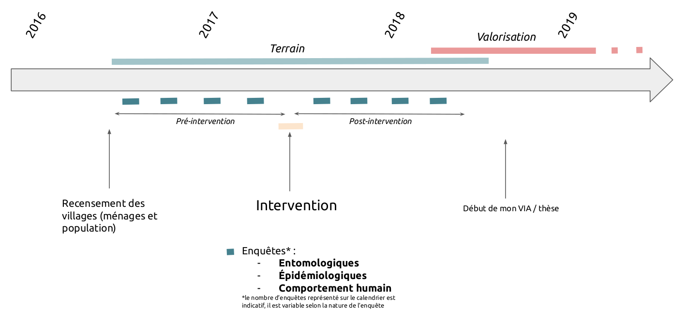
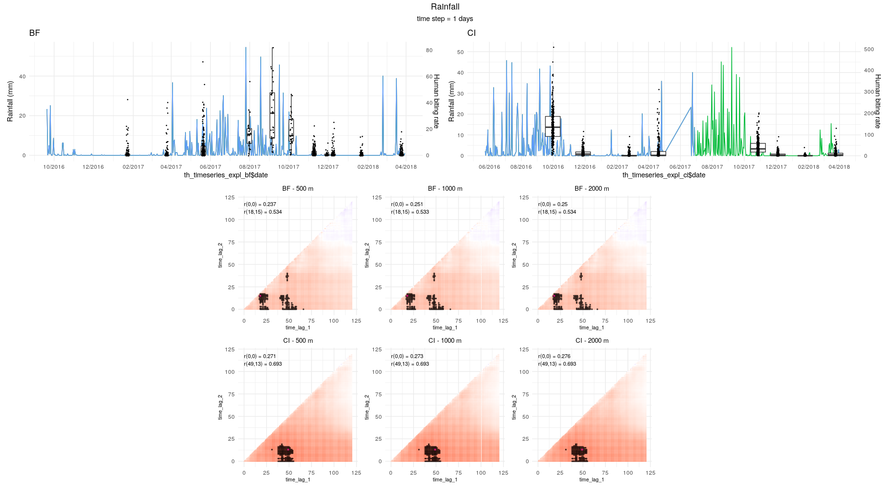

```{r setup, include=FALSE}
knitr::opts_chunk$set(echo = FALSE,
                      message = FALSE,
                      warning = FALSE)

knitr::opts_knit$set(root.dir = rprojroot::find_rstudio_root_file()) #set t
```

```{r packages}
library(ggplot2)
library(scales)
library(sf)
library(DBI)
library(RSQLite)
library(dplyr)
library(tidyr)
library(purrr)
library(rlang)
library(patchwork)
library(plotly)
library(htmlwidgets)
library(kableExtra)
library(mapview)
library(stringr)
library(emo)
library(facetscales)
```

```{r db_connect}
# connect to database
path_to_db <- "data/react_db/react_db.gpkg"
react_gpkg <- DBI::dbConnect(RSQLite::SQLite(),dbname = path_to_db)

# open tables
trmetrics_entomo <- dbReadTable(react_gpkg, 'trmetrics_entomo', stringsAsFactors = F)
entomo_csh_metadata_l1 <- st_read(path_to_db, 'entomo_csh_metadata_l1', quiet=T, stringsAsFactors = F)
recensement_villages_l1 <- st_read(path_to_db,"recensement_villages_l1", quiet=T, stringsAsFactors = F) %>%
  filter(!is.na(intervention)) %>%
  dplyr::select("codevillage","codepays","nomvillage","population","intervention","date_debut_interv","date_fin_interv","X","Y")

trmetrics_entomo2 <- dbReadTable(react_gpkg, 'trmetrics_entomo_postedecapture') %>%
  left_join(entomo_csh_metadata_l1[c("idpointdecapture","nummission","codevillage","pointdecapture","codepays","date_capture","X","Y")], by = "idpointdecapture")

trmetrics_epidemio <- dbReadTable(react_gpkg, 'trmetrics_epidemio')

# # join to trmetrics_entomo the tables related to the HLC dates and locations + villages
# trmetrics_entomo <- trmetrics_entomo %>%
#   left_join(entomo_csh_metadata_l1[c("idpointdecapture","nummission","codevillage","pointdecapture","codepays","date_capture","X","Y")], by = "idpointdecapture") %>%
#   left_join(recensement_villages_l1[c("codevillage","intervention","date_debut_interv","date_fin_interv")], by = "codevillage") %>%
#   dplyr::select(-fid)

# get the number of human - nights
idpointdecaptures <- dbReadTable(react_gpkg, 'entomo_csh_metadata_l1') %>%
  dplyr::select(idpointdecapture,nummission,codevillage,pointdecapture,codepays,date_capture)

csh_exterior <- data.frame(idpointdecaptures, postedecapture = "e")
csh_interior <- data.frame(idpointdecaptures, postedecapture = "i")
csh_all <- rbind(csh_exterior,csh_interior) %>%
  left_join(recensement_villages_l1) %>%
  mutate(phase_interv = ifelse(as.Date(date_capture) < as.Date(date_debut_interv),"pre-intervention","post-intervention")) %>%
  mutate(phase_interv = ifelse((is.na(phase_interv) & codepays=="BF" & as.Date(date_capture) < as.Date("2017-08-17")),"pre-intervention",phase_interv)) %>%
  mutate(phase_interv = ifelse((is.na(phase_interv) & codepays=="CI" & as.Date(date_capture) < as.Date("2017-09-01")),"pre-intervention",phase_interv)) %>%
  mutate(phase_interv = ifelse((is.na(phase_interv) & codepays=="BF" & as.Date(date_capture) > as.Date("2017-08-17")),"post-intervention",phase_interv)) %>%
  mutate(phase_interv = ifelse((is.na(phase_interv) & codepays=="CI" & as.Date(date_capture) > as.Date("2017-09-01")),"post-intervention",phase_interv))


# get mean date for each entomo mission in each country
mean_date_by_mission <- entomo_csh_metadata_l1 %>%
  group_by(codepays,nummission) %>%
  summarise(date = mean(as.Date(date_capture))) %>%
  as_tibble()

# get start and end date of intervention for each country
dates_intervention <- recensement_villages_l1 %>%
  group_by(codepays) %>%
  summarise(start_intervention_date=min(as.Date(date_debut_interv),na.rm = T),end_intervention_date=max(as.Date(date_fin_interv),na.rm = T))
  
```

## Introduction

Ce document de travail a pour objectif de présenter une méthode de modélisation de différents traits et préférences (bioécologiques, comportementaux et phénotypiques) des principales espèces vectrices du paludisme à échelle paysagère en milieu rural ouest-africain, en vue de la rédaction d'un article scientifique portant sur ces questions. L'objectif principal de cet article est de tenter d'expliquer ces traits avec des variables explicatives diverses (climatiques, occupation du sol, de comportement humain, etc.).

Les variables que nous souhaitons expliquer sont les suivantes : 

- densité agressive (*human biting rate*) : abondance des piqures ds différentes espèces vectrices du paludisme ;
- résistances physiologiques : Prévalence des différents génotypes résistants chez les vecteurs ;
- résistances comportementales : Proportion de vecteurs piquant avant XX h le soir (agréssivité précoce), entre XXh et YYh (pas de résistance), ou après YY h le matin (agréssivité tardive) ;
- exophagie : Proportion de vecteurs piquant en extérieur. 

Nous avons réfléchi ce document méthodologique par rapport à la variable a expliquer "densité agressive" des vecteurs. Parmi les 4 variables mentionnées, c'est probablement la plus délicate à modéliser au regard de i) sa distribution statistique complexe (binomiale négative avec excès de zéro) et ii) le nombre de variable explicatives considérées. Nous pensons que la méthode détaillée dans ce document peut être étendue aux autres variables, qui présentent des distributions statistiques plus simples et un nombre de variables explicatives moins importantes. 


## Présentation des variables à expliquer

La variable que l'on cherche à modéliser est la densité agressivité des espèce majeure d'Anophèles. Il s'agit donc d'une variable de comptage (valeurs numériques discrètes). Nous utilisons des données receuillies par capture sur sujet humain, sur deux zones d'études différentes - Côte d'Ivoire (CI) et Burkina Faso (BF) - pendant environ 1,5 années.

Nous proposons d'étudier séparement les deux zones d'études pour chaque variable à modéliser car i) la densité agressive est significativement plus importante en CI qu'au BF et ii) certaines variables explicatives sont disponibles dans une zone mais pas dans l'autre. Ainsi il sera intéressant de tenter de comprendre ce qui explique les différences entre les deux zones.

La distribution statistique de chacune de ces variables à modéliser est donnée dans la section "Choix du modèle statistique pour l'analyse de nos données". L'analyse de cette distribution permettra d'orienter le choix du modèle à utiliser pour modéliser chacune des variables.

```{r var_a_expliquer, eval = F }
googlesheets4::sheets_deauth()
df_indicators <- googlesheets4::read_sheet("https://docs.google.com/spreadsheets/d/1dIeSOa2WinXvOQGLmIjA0gFdsHnb6zMMsDME-G5pyMc/edit?usp=sharing", sheet = "var_reponse3", col_types="c")
df_indicators %>%
  kable() %>%
  kable_styling(bootstrap_options = c("striped", "hover", "condensed"))
```

### Source des données terrain : le projet REACT

La carte suivante présente la localisation des villages de l'étude dans les deux zones. L'objectif principal du projet REACT est d'étudier, par essai randomisé contrôlé (ERC), l'impact de la mise en place de mesure de lutte anti-vectorielle (LAV) complémentaires à l'utilisation des moustiquaires imprégnées d'insecticides sur la population de vecteurs et l'incidence du paludisme. Ainsi au cours de l'étude chaque village s'est vu attribué au hasard une méthode de LAV complémentaire. Un lot de village témoin ("contrôle") n'a pas reçu de méthode de LAV complémentaire, conformément à la méthode ERC.

```{r map}
areas <- st_read(path_to_db,"contexte_frontieresreact", quiet=T)
mapview(areas, alpha.regions = 0.1, aplha = 1, layer.name = "Study areas") + mapview(recensement_villages_l1, zcol = "intervention", cex = 4, alpha.regions = 0.9, aplha = 1, layer.name = "Villages")
```

<!--
La figure ci-dessous présente le calendrier simplifié du projet : 

```{r }

```

Pour plus d'informations sur le type de données recueillies pendant le projet et la fréquence de collecte, se référer à la diapo disponible ici : https://docs.google.com/presentation/d/1UBhYPivf3zSXCl3XHUJaCtYjg8jGFTv66rh3OIphuGw/edit#slide=id.g6af768661d_0_222
-->

A titre d'exemple, le tableau ci-après donne les dates des missions entomologiques dans les deux zones d'étude et les captures totales d'Anophèles, et les figures qui suivent donnent la distribution du nombre de piqures par homme et par nuit (human biting rate, abbrégé ma), toutes espèces d'Anophèles confondues, sur les deux zones d'études, tous traitements confondus puis en fonction des différents traitements.

```{r ma_b_country}
# by country

a<-trmetrics_entomo %>%
  filter(var=="ma",genre=="Anopheles") %>%
  group_by(nummission,codepays) %>%
  summarise(ma=sum(val)) %>%
   as_tibble() %>%
  mutate(nummission = as.numeric(nummission))

kable(entomo_csh_metadata_l1 %>%
  st_drop_geometry() %>%
  group_by(codepays,nummission) %>%
  summarise(date = mean(as.Date(date_capture))) %>%
  as_tibble() %>%
  mutate(nummission = as.numeric(nummission)) %>%
  filter(nummission<=8) %>%
  arrange(codepays,nummission,date) %>%
  left_join(a) ) %>%
  kable_styling(bootstrap_options = c("striped", "hover", "condensed"))

ma_an <- trmetrics_entomo %>%
  filter(genre=="Anopheles", var=="ma", as.numeric(nummission) <= 8) %>%
  group_by(idpostedecapture,codepays, nummission, intervention) %>%
  summarise(val = sum(val))

bf <- ggplot(ma_an %>% filter(codepays == "BF", nummission <= 8), aes(x = nummission, y = val, fill = intervention)) +
   geom_boxplot(outlier.shape = NA) +
   ylim(0,40) + # 40 for BF, 400 for CI
   geom_vline(xintercept = 3.5, colour = "red", size = 0.3) +  # 3.4 for BF, 4.5 for CI
   annotate(geom="text",label="start of interventions",x = 3.7, y = 37, colour = "red", angle = 90, size = 3.5) +
   theme_minimal() +
   labs(y = "Human biting rate (all Anoph. species)") +
  ggtitle("BF")


ci <- ggplot(ma_an %>% filter(codepays == "CI", nummission <= 8), aes(x = nummission, y = val, fill = intervention)) +
   geom_boxplot(outlier.shape = NA) +
   ylim(0,400) + # 40 for BF, 400 for CI
   geom_vline(xintercept = 4.5, colour = "red", size = 0.3) +  # 3.4 for BF, 4.5 for CI
   annotate(geom="text",label="start of interventions",x = 4.7, y = 370, colour = "red", angle = 90, size = 3.5) +
   theme_minimal() +
   labs(y = "Human biting rate (all Anoph. species)") +
  ggtitle("CI")


th_timeseries_resp_bf <- trmetrics_entomo2 %>%
    left_join(entomo_csh_metadata_l1[c("idpointdecapture","codepays","date_capture","nummission")], by = "idpointdecapture") %>%
    filter(codepays.x == "BF") %>%
    left_join(mean_date_by_mission %>% filter(codepays=="BF"), by = c("nummission.x"="nummission"))
  
th_timeplot_bf <-  ggplot() + 
    geom_boxplot(aes(x = th_timeseries_resp_bf$date, y = th_timeseries_resp_bf$ma_an, group = th_timeseries_resp_bf$date), show.legend = TRUE, outlier.shape=NA) + 
    geom_jitter(aes(x = th_timeseries_resp_bf$date, y = th_timeseries_resp_bf$ma_an, group = th_timeseries_resp_bf$date), position=position_jitter(2), cex=0.3) + 
    scale_x_date(date_labels = "%m/%Y", date_breaks = "2 months") +
    theme(axis.text.x = element_text(angle = 90, hjust = 1)) +
    theme_minimal() +
    ggtitle("BF") +
    ylim(0,60)  +
  ylab("Human biting rate (all An. species)")


th_timeseries_resp_ci <- trmetrics_entomo2 %>%
    left_join(entomo_csh_metadata_l1[c("idpointdecapture","codepays","date_capture","nummission")], by = "idpointdecapture") %>%
    filter(codepays.x == "CI") %>%
    left_join(mean_date_by_mission %>% filter(codepays=="CI"), by = c("nummission.x"="nummission"))
  
th_timeplot_ci <-  ggplot() + 
    geom_boxplot(aes(x = th_timeseries_resp_ci$date, y = th_timeseries_resp_ci$ma_an, group = th_timeseries_resp_ci$date), show.legend = TRUE, outlier.shape=NA) + 
    geom_jitter(aes(x = th_timeseries_resp_ci$date, y = th_timeseries_resp_ci$ma_an, group = th_timeseries_resp_ci$date), position=position_jitter(2), cex=0.3) + 
    scale_x_date(date_labels = "%m/%Y", date_breaks = "2 months") +
    theme(axis.text.x = element_text(angle = 90, hjust = 1)) +
    theme_minimal() +
    ggtitle("CI") + 
    ylim(0,400) +
  ylab("Human biting rate (all An. species)")

bf
ci

th_timeplot_bf / th_timeplot_ci
  
```

### Etude de la distribution statistique de la variable à expliquer

L'analyse visuelle de ces deux derniers graphiques laisse penser que la variable à expliquer (nombre de piqures d'Anophèles) suivra une distribution asymétrique, avec de nombreux comptes nuls ou proches de zéro, et une proportion moins importante de comptes positifs >> 0 . Nous vérifions cette hypothèse en représentant la fréquence des comptes (toutes missions entomologiques confondues) : 

```{r }
ggplot(trmetrics_entomo2, aes(x = ma_an)) +
   geom_histogram(color="black", fill="white", stat="count") +
  facet_wrap(~codepays, scale="free") + 
  ylab("Human biting rate (frequency)")
```

Nous confirmons donc notre hyopthèse : il s'agit de distributions binomiales négatives. Par ailleurs, nous avons vérifié que ces distributions présentent également un excès de zéros (*zero inflation*) en comparant la sortie de modèles GLMM ZINB et ZIP et en vérifiant que la différence entre les deux modèle était significative.

En modélisation statistique "traditionnelle", ces types de distributions sont souvent analysées avec des modèles paramétriques type «Zero Inflated Negative Binomial » (ZINB) ou modèles de haie (hurdle model). Ces modèles sont largement reconnus par la communauté scientifique et ont été utilisés à de maintes reprises pour modéliser des compte de piqures (aggréssivité) de vecteurs (*refs*). Dans nos travaux, nous proposons d'utiliser une autre classe de modèles, à savoir des modèles non-paramétriques (algorithmiques). Nous justifions l'utilisation de ces modèles dans la section 'Méthode de modélisation statistique'. 

### Les variables explicatives / prédictives

Les variables explicatives qui serviront dans les modèles mathématiques sont données dans le tableau suivant, avec les informations notamment sur les données sources utilisées et les pré-traitements effectués. Il s'agit principalement de variables climatiques (températures, précipitations, etc.), paysagères (occupation du sol), anthropiques et démographiques (population). Le tableau est aussi disponible à l'adresse suivante https://docs.google.com/spreadsheets/d/1dIeSOa2WinXvOQGLmIjA0gFdsHnb6zMMsDME-G5pyMc/edit?usp=sharing onglet "var_explication".

Ces variables peuvent être séparées en 3 groupes :

- les **variables spatio-temporelles** : ce sont des variables dont les données sources sont de type raster et ayant une composante temporelle (e.g. températures, précipitations, indices de végétation ou d'eau issus des produits MODIS et Sentinel)
- les **variables spatialisées non temporelles** : ce sont des variables dont les données sources sont de type raster mais n'ayant pas de composante temporelle (e.g. occupation du sol dérivée de l'image SPOT6, altitude, population, etc)
- les **variables non spatialisées et non temporelles** : ce sont des variables dont les données sources ne sont pas rasterisées et n'ont pas de composante temporelle (e.g. méthode de LAV, distance à la frontière du village)

Les variables spatialisées ont été extraites autour de chaque point de capture selon plusieurs zones tampon, afin de mesurer l'éventuelle influence de la variabilité spatiale de ces variables explicatives sur les variables à expliquer. Les rayons des zones tampon dépendent de la résolution spatiale des données sources. Ils vont de 20 mètres (pour les métriques paysagères calculées avec l'images SPOT6 à 1.5 m de résolution spatiale) à 2 km (distance maximum de vol dans la vie d'un moustique selon la bibliographie). Voir le tableau ci-dessous, colonne "buffer_size_extraction_m", pour le détail des tailles de buffer utilisées pour chaque variable.

Les variables temporelles ont été extraites durant les 120 jours (4 mois) précédent la date de capture ou d'enquête épidémiologique, afin de mesurer l'éventuelle influence temporelle de ces variables explicatives sur les variables à expliquer (cela sera fait via la génération de cross correlation maps, cf. section plan d'analyse de données). Cette durée maximale de 120 jours a été utilisée dans d'autres études similaires. Elle permet de couvrir largement la durée de vie d'un vecteur (en général, maximum 1 mois) et de prendre en compte l'éventuelle influence des générations de vecteurs précédent. Notons que les données temporelles ont des résolutions temporelles (i.e. temps de revisite) variables selon les sources : cela va du quotidien (températures de MODIS, précipitations de GPM) au mensuel (lumières noctures) en passant par l'hebdomadaire (évapotranspiration ou indices de végétation de MODIS), la dizaines de jours (Sentinel-1), etc.

Ainsi, si **n** est le nombre de jours précédent la capture pour lesquels nous avons extrait les données temporelles (ici n = 120), **r** la résolution temporelle de la donnée source de la variable à extraire, et **m** le nombre de zones tampon pour une variable spatiale considérée :

- Les données spatialisées et temporelles contiennent, pour chaque couple {point de capture, variable} , **n** / **r** * **m** valeurs ; 
- Les données spatialisées non temporelles contiennent, pour chaque couple {point de capture, variable}, **m** valeurs ;
- Les données non spatialisées non temporelles contiennent, pour chaque couple {point de capture, variable}, 1 valeur ;

Chacune des variables issues de ces trois groupes fera l'objet d'un pré-traitement spécifique dans la modélisation (cf. section plan d'analyse de données).

<!--
Par ailleurs, les variables ont aussi été regroupées suivant plusieurs ensembles fonctionnels :

- groupe 1 : **nature** afin de regrouper les grands types de variables (occupation du sol, températures, précipitations, etc.)
- groupe 2 : **dynamique temporelle** afin d'étudier si les vecteurs sont sensibles aux facteurs à dynamique temporelle courte (i.e. les facteurs env / climatiques durant la nuit de capture), moyenne (i.e. les facteurs env / climatiques précédent la nuit de capture), ou longue / non captée par nos données / inexistante (altitude, etc). Les mesures de contrôle des vecteurs feront l'objet d'un groupe à part.
- groupe 3 : **influence sur les traits fonctionnels des vecteurs** (émergeance, croissance, dispersion, survie, etc.). 

A noter qu'une variable, pour un groupe donné, peut se retrouver dans plusieurs classes à la fois. La méthode d'évaluation de l'importance des variables permet de considérer ces cas. 

L'importance des variables explicatives (i.e. leur influence sur la variable à expliquer) sera évaluée : 
- individuellement : imoportance de chaque variable prise individuellement
- collectivement : importance relative des différents groupes de variables

-->
```{r var_explicative }
df_explicatives <- googlesheets4::read_sheet("https://docs.google.com/spreadsheets/d/1dIeSOa2WinXvOQGLmIjA0gFdsHnb6zMMsDME-G5pyMc/edit?usp=sharing", sheet = "var_explication", col_types="c")
df_explicatives %>%
  kable() %>%
  kable_styling(bootstrap_options = c("striped", "hover", "condensed"))

```

## Méthode de modélisation statistique

### Particularités des données à prendre en considération dans le choix des modèles

Les données que nous modélisons présentent les particularités suivantes : 

- **la distribution de notre variable réponse est asymétrique, plus spécifiquement elle est binomiale négative (surdispersée) avec excès de zéro**. De nombreux modèles ne sont pas adaptés à ce type de distributions (i.e. ces modèles vont tendre à prédire la valeur (cas de la regression) ou la classe (cas de la classification) majoritaire).
- **nos données sont structurées selon plusieurs niveaux spatiaux imbriqués** (point de capture, village de capture), autrement dit nous avons de l'autocorrelation spatiale. Par ailleurs, les données sont aussi temporalisées, puisque nous avons plusieurs relevés (jusqu'à 8) pour chaque point de capture, étendus sur 18 mois. Comme dans le cas de la distribution asymétrique, la pluspart des modèles font l'hypothèse de l'indépendance des observations et ne prennent ainsi pas en compte les structures hiérarchiques ou longitudinales.
- les relations et les intéractions entre les variables à expliquer et les variables explicatives ont de fortes chances d'être complexes, e.g. **non-linéaires et/ou non monotones**. Par exemple, les précipitations peuvent avoir un effet positif sur le nombre de moustiques capturés (via le remplissage des gites larvaires) mais aussi potentiellement négatif (lessivage des gites larvaires). 
- nous avons un **nombre important de variables explicatives**, notamment pour les variables spatio-temporelles (pour lesquelles nous allons tester les corrélations avec la variable réponse selon différentes combinaisons temporelles - voir section "Séléction supervisée des variables explicatives") et les variables d'occupation du sol. Cela implique d'utiliser, au moins en partie, des méthodes automatiques pour pré-séléctionner les variables à inclure dans les modèles multivariés. Ces méthodes devraient idéalement détécter automatiquement la non-linéarité et non-monotonie de la relation entre la variable réponse et la variable à expliquer. 

Nous devrons prendre en compte ces particularités dans le choix des modèles à utiliser. L'analyse des résidus des modèles générés (incluant notamment l'analyse de l'autocorrelation spatiale) permettra de valider les modèles.

### Quels modèles utiliser ? 

Nous présentons ici très succintement les avantages et limites de quelques modèles mathématiques usuels au regard des particularités présentées dans la section précédente :

- les GLMM permettent de modéliser la distribution binomiale négative avec excès de zéro via l'utilisation de modèles de haie ou de modèles ZINB. Par ailleurs, la structure hiérarchique des données peut être prise en compte via l'insertion d'effets aléatoires. Ils présentent aussi l'avantage d'être largement utilisés et reconnus par la communauté scientifique, et simples à intérpréter (i.e. avec les coefficients). Cependant, les GLMM ne permettent pas de repérer des relations ou intéractions complexes entre les variables, et ne permettent typiquement pas d'intégrer un nombre important de variables explicatives.
- les GAMM présentent les mêmes avantages que les GLMM, tout en ayant la capacité de modéliser les relations non-linéaires. Leur intérprétation est moins évidente que les GLMM mais ceci ne constitue à priori pas un frein à leur utilisation.
- les modèles algorithmiques (i.e. arbres de décision, random forest, etc. ) présentent l'avantage de ne pas avoir à faire d'hypothèses à priori sur la distribution statistiques des variables (ce sont des modèles non-paramétriques). Par ailleurs ils peuvent intégrer de nombreuses variables explicatives et sont reconnus pour détecter efficacement les intéractions et relations complexes entre variables. Cependant ils ne gèrent pas nativement la non-indépendance des observations (autocorrélation spatiale et éventuellement temporelle dans notre cas). Par ailleurs, en pratique il a été montré dans certaines études que les distributions asymétriques extrêmes telles que celles de nos variables réponses sont mal gérées par ces modèles. 

### Quels processus modéliser ? 

Comme décrit précédemment, la variable à modéliser suit une distribution binomiale négative avec excès de zéros. Ces distributions sont souvent analysées avec des modèles de "haie". Dans un modèle de haie, deux processus différents sont modélisés : les comptes nuls vs. les comptes positifs (*modèle de présence/absence*) et l'abondance des comptes positifs uniquement (*modèle d'abondance*). Cette séparation est motivée à la fois par des raisons statistiques (un seul et unique modèle gérerait mal ce type de distribution extrème) et par des considérations pratiques : les processus (biologiques, écologiques, etc.) conduisant à la présence des vecteurs peuvent être différents de ceux conduisant à leur abondance. Nous proposons ici de procéder de cette manière, en modélisant séparement la présence et l'abondance des vecteurs.

Nous établirons donc deux modèles : un modèle de présence/absence (classification) et un modèle d'abondance (regression). Comme l'on pose l'hypothèse que les processus conduisant à ces deux situations (présence/absence et abondance) sont différents, idéalement, chacun de ces deux modèles sera établi de manière indépendante, notamment dans la phase de séléction supervisée des variables explicatives à intégrer dans le modèle multivarié. 

### Comment interpréter les modèles ? 

Dans le cas des modèles linéaires, les équations en sortie du modèle présentent l'intéret de procurer, pour chaque variable ou interactions entre variables : i) l'effet (sens et ampleur de l'influence grâce à resp. le signe et taille du coefficient), ii) la significativité de cet effet (grâce à la p-value). Les modèles algorithmiques complexes ne produisent pas d'équations comme celles-ci. Cependant, un certain nombre d'outils a été développé pour rendre ces modèles davantage intérprétables et ainsi extraire des informations similaires à celles que procurent les équations en sortie des modèles linéaires : les variables importantes, l'effet d'une variable ou d'une intéraction entre plusieurs variables sur la variable réponse (partial depence plots), etc. Ces méthodes sont pour la pluspart indépendantes du modèle qui est utilisé (*model-agnostic interpretation methods*).

Ainsi, si l'on utilise ces outils d'interprétation, les éléments les plus importants à considérer dans le choix du modèle à utiliser sont la capacité prédictive et évidemment le respect des hypothèses liées au modèle.

### Séléction supervisée des variables explicatives

Les variables explicatives, en particulier les variables spatio-temporelles et les variables d'occupation du sol, sont très nombreuses et ainsi, quel que soit le modèle multivarié utilisé, il est nécéssaire de les filtrer avant leur intégration dans ce denier. Cette section présente les méthodes envisagées pour séléctionner les variables à insérer dans les modèles multivariés.

#### Variables spatio-temporelles

Comme décrit précédemment, nous avons collecté les variables spatio-temporelles sur une durée de 120 jours avant la date de capture. Plutôt que d'étudier la relation entre la variable à expliquer et la variable explicative pour chaque date prise séparemment, il est intéressant d'étudier des combinaisons d'intervalles temporels. Par exemple : il est plus probable que la somme des précipitations entre n jours et m jours avant la capture explique mieux la densité aggressive que les précipitations ponctuelles j jours avant la capture. 

Pour cela, nous utilisons des cross-correlation maps (CCM) pour étudier les variables temporelles. Pour un lag de temps minimal et un lag maximal fixés ainsi qu’une fonction imposée (par exemple la moyenne ou la somme) les CCM déterminent les deux lags entre lesquels la fonction a la plus forte corrélation avec la variable étudiée. La valeur de la variable explicative entre ces deux lags temporels est ensuite retenue pour les modèles multivariés.

L'objectif ici est donc de définir une méthode pour corréler la variable à expliquer et chaque lag temporel des variables explicatives. Dans la littérature, ce sont des coefficients de corrélation classiques (pearson ou spearman) qui sont utilisés. Ces méthodes présentent l'avantage d'être rapides (élément non négligeable car les combinaisons de lags sont très nombreuses - jusqu'à 7500 pour les variables à résolution temporelle quotidienne) et de fournir à la fois le sens et la force de la corrélation, mais présentent les inconvénients suivants : 

- absence de prise en compte de la non-indépendance des données 
- impossibilité de détecter des relations non-monotones (pearson détécte uniquement les relations linéaires, spearman détecte les relations non-linéaires mais pas les relations non-monotones)
- fonctionne pour la corrélation entre deux variables quantitatives (modèles de d'abondance) mais pas pour une variable binomiale et une variable quantitative (modèle de présence/absence)

A titre d'exemple, la figure suivante donne la CCM pour la série "abondance tous Anopheles confondus" et la variable "précipitations quotidiennes" en utilisant un simple coefficient de Spearman :

```{r }

```

**Les questions auxquelles nous devons répondre quand à la séléction des variables explicatives temporelles sont donc les suivantes :**

**- Quel(s) test(s) ou modèles statistique(s) implémenter pour séléctionner la(es) variable(s) à retenir dans le modèle multivarié de présence / absence ?**

**- Quel(s) test ou modèles statistique(s) implémenter pour séléctionner la(es) variable(s) à retenir dans le modèle multivarié d'abondance ?**

##### Modèle de présence/absence

Pas encore d'idée ici... 

- régression logistique (binaire) (modèle GLMM) et on plotte la p-value dans les CCM ? 
- 

##### Modèle d'abondance

**Proposition n°1 : ** *Voir code R, ligne 137)*

Le package 'correlation' de R permet de calculer des coefficients de corrélations classiques (pearson, spearman, etc) tout en intégrant un facteur comme effet aléatoire (voir https://easystats.github.io/correlation/articles/multilevel.html ). Aussi, nous pourrions utiliser ce package pour calculer un coefficient de Spearman en intégrant le village en effet aléatoire. 
avantages : prise en compte de l'effet aléatoire au niveau du village, force et signe de l'effet, détéction de relation non-linéaires

inconvénients : non détéction de relations non-monotones

**Proposition n°2 : ** *Voir code R, ligne 146)*

Avec le même package, on peut utiliser le coefficient de corrélation de distance. Ce coefficient permet non seulement de détécter les relation non-linéaires mais aussi les relations non-monotones (cf https://en.wikipedia.org/wiki/Distance_correlation). Par contre, il n'est pas possible d'intégrer un facteur comme effet aléatoire.

avantages : détéction de relation non-linéaires + non-monotones

inconvénients : non prise en compte de l'effet aléatoire village

**Proposition n°3 : **  *Voir code R, ligne 155)*

Le package 'glmertree' (Generalized linear mixed-effects model trees) de R permet de générer des arbres de décision tout en intégrant des effets aléatoires comme dans un modèle linéaire mixte. "The estimation algorithm iterates between (1) estimation of the tree given an offset of random effects, and (2) estimation of the random effects given the tree structure." L'intéret d'utiliser un arbre de décision est sa capacité à détecter des relations complexes entre les variables. Par ailleurs l'introduction d'effets aléatoires permet de gérer la problématique de non indépendance des données. Finalement, un des avantages des glmertree est la gestion de tous types de variables réponses (quantitatives continues, quantitatives discrètes, binomiales).

Voir help(glmertree) section Details, pour un court résumé de la théorie des Generalized linear mixed-effects model trees ; https://link.springer.com/article/10.3758/s13428-017-0971-x pour l'article scientifique complet ; et vignette("glmertree") pour un tutoriel.

Cependant la question dans cette méthode est celle de la valeur quantitative finale à considérer dans les CCM. Dans les propositions 1 et 2 (voir ci-dessus), c'est le coefficient de corrélation qui est représenté, et la série présentant le coefficient le plus important est séléctionnée pour la suite des travaux. Dans le cas des glmertree, quelle valeur considérer ? 

- R^2 de la prédiction (ie on prédit les valeurs avec le modèle généré puis on calcule le r2) ? 
- coefficient de correlation de Pearson entre les valeurs réelles et les valeurs prédites ? 
- autres idées ?? 

#### Variables d'occupation du sol

*Voir code R, ligne 195)*

Les variables d'occupation du sol sont des métriques paysagères (*landscape metrics*) qui ont été calculées selon plusieurs rayons de zones tampon autour de chaque point de capture (pour prendre en compte l'influence de la taille de la zone tampon considérée). 

**Ainsi, nous avons au total environ 300 variables d'occupation du sol, qu'il est nécéssaire de filtrer avant intégration dans les modèles multivariés. Les problématiques sont les mêmes que pour les variables temporelles : **

**- comment séléctionner les variables à intégrer dans les modèles multivariés de présence/absence ? **

**- comment séléctionner les variables à intégrer dans les modèles multivariés d'abondance ? **


##### Modèle de présence/absence

*à définir*

##### Modèle d'abondance

*à définir*

Comme la proposition n°1 des variables spatio-temporelles, mais en prenant le numéro de mission comme facteur aléatoire. 

#### Autres variables

*Voir code R, ligne 209 à 244)*

Les autres variables sont principalement des variables liées à la topographie (altitude, pente, réseau hydrographique théorique, etc.), à la démographie (population), aux conditions micro-climatiques la nuit de capture (vent, précipitations, température, humidité, etc.). 

Si l'on utilise des modèles algorithmiques (type random forest) pour la modélisation multivariée, il ne sera pas nécéssaire d'effectuer une pré-séléction de ces variables (ces modèles gèrent efficacement un grand nombre de variables explicatives). Si l'on utilise un modèle paramétrique plus classique (GLMM, GAMM), on devra les filter.


### Evaluation de la multicollinéarité

Quel que soit le modèle multivarié utilisé, il est important de prendre en compte la multicollinéarité entre les variables explicatives. La présence de variables collinéaires peut impacter la qualité du modèle lui même et / ou l'interprétation (par exemple dans le cas des variables d'importance ou des partial dependence plots). 

Idéalement l'identification de la multicollinéarité dépend du modèle utilisé en modélisation multivarié :

- si le modèle mutivarié est linéaire (ex. GLMM), le VIF (variance inflation factor), basé sur la méthode des moindres carrés ordinaire, permet de détécter la multicollinéarité
- si le modèles est algorithmique (eg random forest), il est plus pertinent de détecter la multicollinéarité en utilisant un modèle algorithmique (typiquement le même modèle que celui qui sera utilisé en modélisation multivariée, voir par ex. https://explained.ai/rf-importance/)

*from https://explained.ai/rf-importance/*

"A way to identify if a feature, x, is dependent on other features is to train a model using x as a dependent variable and all other features as independent variables (this is called Multicollinearity). Because random forests give us an easy out of bag error estimate, the feature dependence functions in rfpimp rely on random forest models. The R^2 prediction error from the model indicates how easy it is to predict feature x using the other features. The higher the score, the more dependent feature x is. The feature importance of non-x features predicting x give an indication of which features have predictive power for feature x" 


### Modèles multivariés

Comme décrit précédemment, il semble intéressant dans notre cas d'utiliser des modèles algorithmiques (non paramétriques), de part la quantité importante de variables explicatives et la forte probabilité de présence de relations non-linéaires et intéractions complexes entre variables. Ces modèles, réputés "black box", sont aujourd'hui interprétables gràce aux divers outils développés (voir https://christophm.github.io/interpretable-ml-book/agnostic.html).

Nous proposons ici de tenter d'utiliser les modèles de foret aléatoire (random forest) à la fois pour la modélisation de la présence/absence de vecteurs (modèle de classification) et de l'abondance (modèle de régression).

Cependant les modèles algorithmiques présentent des limites qu'il est important de considérer : 

- nativement, il supposent l'indépendance des observations : autrement dit, ils ne sont pas faits pour gérer des données non-indépendantes comme les notres (et donc ils ne gèrent pas nativement l'auto-correlation spatiale)
- ils performent mal dans le cas de données déséquilibrées ("imbalanced data"), à savoir quand une classe ou valeur est sur-représentée. Dans ce cas, il tendent à prédire la valeur de la classe sur-représentée

Ces limites ne sont pas un problème dans les méthodes statistiques "classiques" :

- l'introduction d'effets aléatoires dans les modèles type GLM ou GAM permet de prendre en compte l'autocorrelation spatiale
- les familles de fonctions permettent de spécifier une distribution statistique à priori et une fonction de lien, afin de prendre en considération la forme binomiale négative (dans notre cas) de la variable à expliquer

Comme nous allons le voir ces limites ont été identifiées et étudiées ces dernières années dans le cas des modèles algorithmiques et des solutions ont été proposées pour y remédier.

#### Proposition de solutions au problème de la non-indépendance des observations

- Solution n°1 : intégrer dans le modèle des variables renseigant la dimension géographique des données. Certaines études montrent que l'insertion de variables géographiques permettent de considérer l'auto-corrélation spatiale. La théorie est la suivante : si le phénomène étudié exhibe un caractère spatial qui a une importance, les variables géographiques seront prises en compte dans le modèle. Certaines études préconisent d'intégrer les coordonnées géographique des points observations (X et Y), d'autres la matrice de distance entre tous les points d'observation (https://peerj.com/articles/5518/), d'autres encore les coordonnées géographiques ainsi que les distances à certains points fixes de la zone d'étude (par exemple les 4 extrémités et le centre) (https://doi.org/10.1111%2Fejss.12687). 

- Solution n°2 : insérer des variables renseignant les effets aléatoires. Certaines études montrent que la simple introduction des effets aléatoires en tant que variables explicatives dans le modèle permet de considérer ces effets. Ici nous pourrions donc introduire les colonnes "codevillage" (e.g. 'BOH'), "pointdecapture" (e.g. '1') et "idpointdecapture" (e.g. 'BOH1') pour considérer les effets aléatoires.

- Solution n°3 : mixed - effects random forest (MERF) : L'idée des mixed - effects random forest est d'insérer des effets aléatoires dans le modèle de random forest. Une explication des mixed-effect random forest est donnée ici : https://towardsdatascience.com/mixed-effects-random-forests-6ecbb85cb177 . Problème : les tentatives de constructions de packages de Mixed effect random forest sur R n'ont pas l'air très concluantes... Sur Python il existe un package qui semble assez aboutit (https://pypi.org/project/merf/) mais je ne maitrise pas Python. 

#### Propositions de solutions au problème du déséquilibre du nombre d'observations dans les classe

Pour la classification, il s'agit de modéliser 2 classes : présence ou absence de piqure sur chaque nuit de capture. Pour toutes les espèce, la classe "absence" est largement majoritaire sur la classe "présence", autrement dit, il y a eu beaucoup plus de nuits de capture avec absence de capture qu'avec présence d'au moins 1 capture. Aussi, nous sommes dans un cas typique d'"imbalanced data", où les modèles algorithmiques performent mal. 

Pour la régression, nous faisons face à un problèle similaire : bien que nous ayions enlevé la valeur 0 piqures grâce à la séparation de la modélisation "présence/absence" et "abondance", la distribution de la série statistique reste binomiale négative : la valeur "1 piqure" concentre environ la moitié des valeurs, qui vont jusqu'à plus de quarante piqures parfois. 

Des méthodes ont été proposées pour remédier à ce problème. En général, il s'agit de méthode de rééchantillonage des observations (augmentation du nombre d'observations de la classe minoritaire, ou diminution du nombre d'observations de la classe majoritaire, ou un équilibre entre les deux méthodes).

- Solution 1 : rééchantilloner la(es) classe(s) minoritaire(s) (afin de ne pas perdre d'information concernant la classe majoritaire) avec la méthode SMOTE (Synthetic Minority Over-sampling Technique). En sortie de cet algorithme, le nombre d'observations par classe est équilibré.

- Solution 2 : Une autre solution qui pourrait être testée consiste à pondérer les observations, et insérer ces poids dans le modèle. A priori, dans un modèle de foret aléatoire les observations à utiliser en entrée de chaque arbre de décision sont séléctionnées de manière aléatoire. Si l'on pondère les observations, une observation avec un poids important sera plus souvent séléctionnée pour générer les arbres de décision, qu'une observation avec un poids faible.

- Solution 3 (classification binomiale uniquement) : les random forests quantile classifier (http://web.ccs.miami.edu/~hishwaran/papers/OI_PatternRecognition_2019.pdf) implémentés dans le package R rfsrc (fonction imbalanced.rfsrc)

### Evaluation de la qualité des modèle

*[section à terminer]*

Le modèle sera cross-validée en utilisant un méthode leave-one-mission-out : toutes les missions sauf une seront tour à tour utilisées pour entrainer le modèle, puis la mission qui n'a pas été utilisée pour l'entrainement sera utilisée pour la validation. 

L'auto-corrélation des résidus du modèle (residual spatial autocorrelation) sera évaluée (via des variogrammes ou le calcul du I de Moran) pour le valider.


### Intérprétation des modèles

*[section à terminer]*

-> on mesure l'importance des variables (par ex. minimum depth et permutation importance)

-> on calcule les intéractions entre les variables les plus importantes

-> on mesure l'effet d'une variable explicative sur la variable réponse (avec des PDP et des ICE) (main effects) en prenant en compte l'ensemble des effets des autres variables explicatives et intéractions entre variables

-> on mesure l'intéraction entre 2 variables explicatives sur la variable réponse (avec des PDP) (second order effects), de même, en prenant en compte l'ensemble des effets des autres variables explicatives et intéractions entre variables

